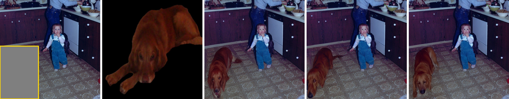
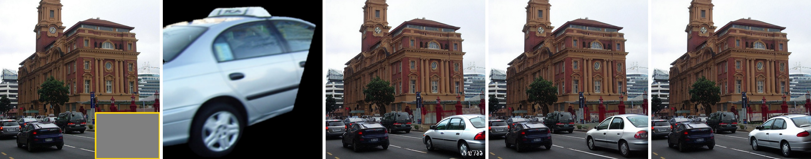
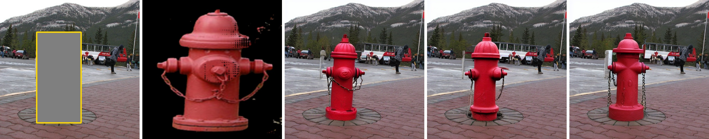
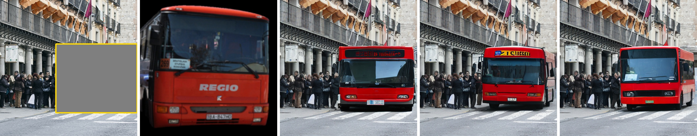

# ObjectStitch-Image-Composition
This is an unofficial implementation of the paper ["ObjectStitch: Object Compositing with Diffusion Model"](https://openaccess.thecvf.com/content/CVPR2023/papers/Song_ObjectStitch_Object_Compositing_With_Diffusion_Model_CVPR_2023_paper.pdf), CVPR 2023.

For better detail preservation and controllability, you can refer to our [ControlCom](https://github.com/bcmi/ControlCom-Image-Composition). 


## Introduction

Our implementation is built upon [Paint-by-Example](https://github.com/Fantasy-Studio/Paint-by-Example) by feeding masked foreground images and using all class and patch tokens of the foreground image as conditional embedding. The model is trained with the same dataset (*i.e.*, Open Images) and hyperparameters as Paint-by-Example, in which the foreground masks of training images are generated by [Segment-Anything](https://github.com/facebookresearch/segment-anything).


## Get Started

### 1.  Dependencies

  - torch==1.11.0
  - pytorch_lightning==1.8.1
  - install dependencies:
    ```bash
    cd ObjectStitch-Image-Composition
    pip install -r requirements.txt
    cd src/taming-transformers
    python setup.py install
    ```

### 2.  Download Models

  - Please download the following files to the ``checkpoints`` folder to create the following file tree:
    ```bash
    checkpoints/
    ├── ObjectStitch.pth
    └── openai-clip-vit-large-patch14
        ├── config.json
        ├── merges.txt
        ├── preprocessor_config.json
        ├── pytorch_model.bin
        ├── tokenizer_config.json
        ├── tokenizer.json
        └── vocab.json
    ```
  - **openai-clip-vit-large-patch14 ([Huggingface](https://huggingface.co/BCMIZB/Libcom_pretrained_models/blob/main/openai-clip-vit-large-patch14.zip) | [ModelScope](https://www.modelscope.cn/models/bcmizb/Libcom_pretrained_models/file/view/master/openai-clip-vit-large-patch14.zip))**.

  - **ObjectStitch.pth ([Huggingface](https://huggingface.co/BCMIZB/Libcom_pretrained_models/blob/main/ObjectStitch.pth) | [ModelScope](https://www.modelscope.cn/models/bcmizb/Libcom_pretrained_models/file/view/master/ObjectStitch.pth))**.
  

### 3. Inference on examples

  - To perform image composition using our model, you can use `scripts/inference.py`. For example,

    ```
    python scripts/inference.py \
    --outdir results \
    --testdir examples \
    --num_samples 3 \
    --sample_steps 50 \
    --gpu 0
    ```
    or simply run:
    ```
    sh test.sh
    ```
    These images under ``examples`` folder are obtained from [COCOEE](https://github.com/Fantasy-Studio/Paint-by-Example) dataset. 

### 4. Create composite images for your dataset

- Please refer to the [examples](./examples/) folder for data preparation:
  - keep the same filenames for each pair of data. 
  - either the ``mask_bbox`` folder or the ``bbox`` folder is sufficient.

## Visualization Results

We showcase several results generated by the released model. In each example, we display the background image with a bounding box (yellow), the foreground image, and three randomly sampled images. 

<p align='center'>  
  
  
  
  
  
</p>

## Other Resources
+ We summarize the papers and codes of generative image composition: [Awesome-Generative-Image-Composition](https://github.com/bcmi/Awesome-Generative-Image-Composition)
+ We summarize the papers and codes of image composition from all aspects: [Awesome-Image-Composition](https://github.com/bcmi/Awesome-Image-Composition)
+ We summarize all possible evaluation metrics to evaluate the quality of composite images:  [Composite-Image-Evaluation](https://github.com/bcmi/Composite-Image-Evaluation)
+ We write a comprehensive survey on image composition: [the latest version](https://arxiv.org/pdf/2106.14490.pdf)
